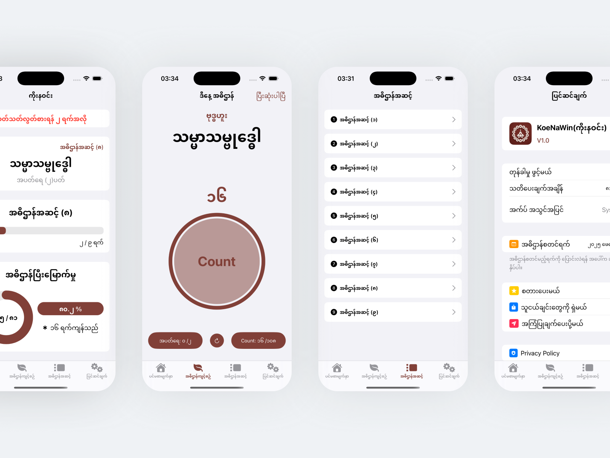
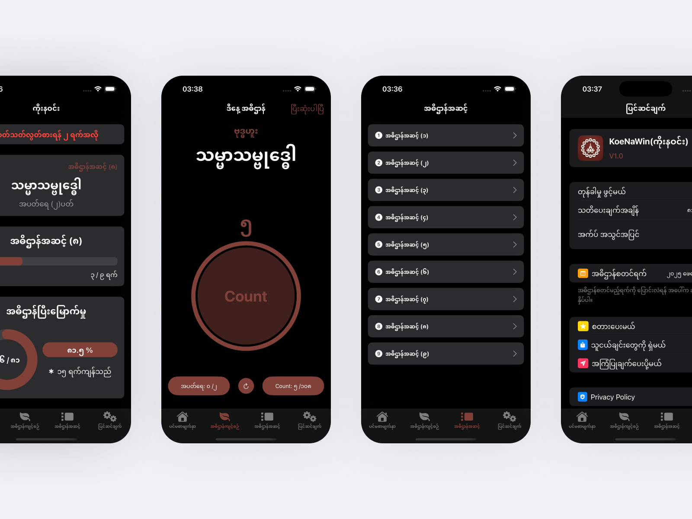
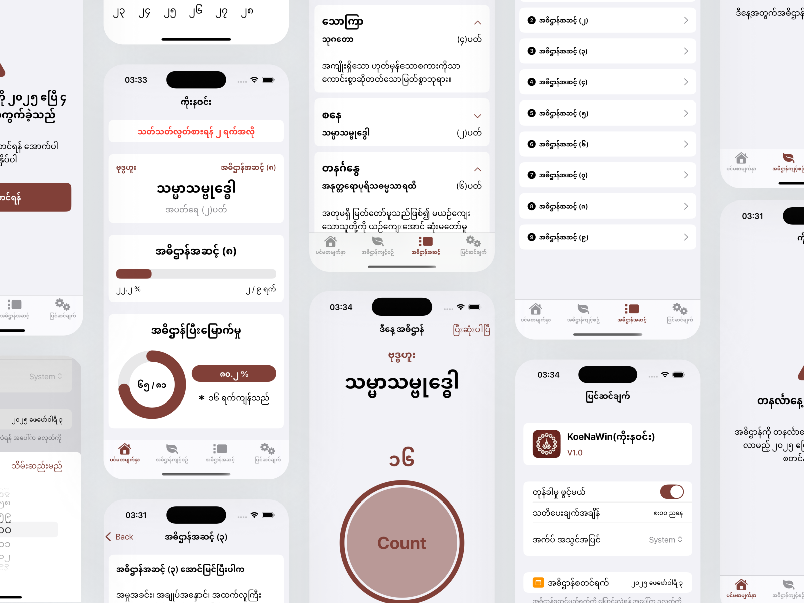

# KoeNaWin

KoeNaWin is a digital companion app for practicing the traditional Koe Na Win (ကိုးနဝင်း) Buddhist discipline. The app guides users through a structured 81-day spiritual journey, providing daily mantras, progress tracking, and reminders, all based on authentic Koe Na Win practices.

## Try It Out

Download from the App Store:

[](https://apps.apple.com/us/app/koenawin-practice/id6747106061)


## Screenshots

<!-- Add your screenshots here -->





## Features

- **Daily Practice Guidance:**  
  Get your daily mantra, the number of recitations, and whether vegetarian practice is required for the day.

- **Progress Tracking:**  
  Visualize your journey through 9 stages, each with unique benefits and prayers.

- **Automatic Scheduling:**  
  The practice can only be started on a Monday, following traditional rules.

- **Vegetarian Reminders:**  
  The app notifies you in advance when a vegetarian day is approaching.

- **Failure Handling:**  
  If you miss a day, your progress is reset, and a record is kept for reflection.

- **Buddha’s Nine Attributes:**  
  Learn about the nine attributes of the Buddha, with detailed explanations in Burmese.

- **Modern, Intuitive UI:**  
  Clean interface with progress bars, confirmation dialogs, and motivational feedback.

## Getting Started

### Requirements

- iOS 16.0+
- Xcode 14+
- Swift 5.7+

### Installation

1. Clone the repository:
    ```bash
    git clone https://github.com/nanda-wk/KoeNaWin.git
    ```
2. Open `KoeNaWin.xcodeproj` in Xcode.
3. Build and run on your simulator or device.

## Project Structure

- **KoeNaWin/**  
  Main app source code, including:
  - `Models/` – Defines the data structures for mantras, practice stages, and user progress.
  - `Features/` – Contains all core features and UI logic that power the app's functionality.
  - `Resources/` – Includes JSON files with static content like mantras, stages, and Buddha’s attributes.
  - `CoreData/` – Handles local data persistence, including progress tracking and failure history.
  - `Utils/` – Utility files (e.g., app version).

- **KoeNaWinTests/**  
  Unit tests for core logic and data models.

## Data Sources

- **KoeNaWin.json:**  
  Contains the 9 stages, each with daily prayers, mantras, and vegetarian requirements.

## How It Works

1. **Start Practice:**  
   Begin your Koe Na Win journey on a Monday. The app will guide you through each day’s mantra and requirements.

2. **Daily Progress:**  
   Complete the required rounds for the day. Your progress is tracked and visualized.

3. **Missed a Day?**  
   If you miss a day, your progress resets, and a record is kept for your review.

4. **Completion:**  
   Successfully complete all 81 days to finish the Koe Na Win cycle.

## License

[MIT License](LICENSE)

## Acknowledgements

- Traditional Koe Na Win practice and literature.

---

**May your Koe Na Win journey be fruitful and bring you peace.**
